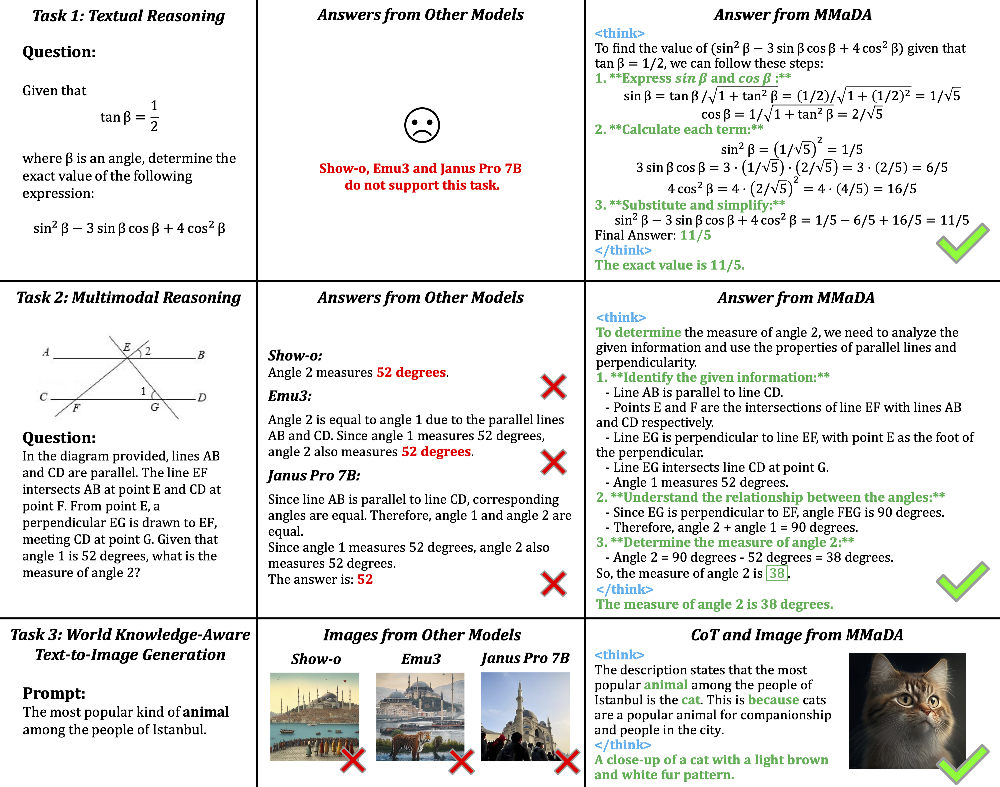

<div align="center">
<br>

<h3>Multimodal Large Diffusion Language Models</h3></div>

<p align="center">
  <a href="https://arxiv.org/abs/2505.15809">
    
  </a>
  <a href="https://huggingface.co/spaces/Gen-Verse/MMaDA">
    
  </a>
  <a href="https://huggingface.co/Gen-Verse/MMaDA-8B-Base">
    
  </a>
    <a href="https://huggingface.co/Gen-Verse/MMaDA-8B-MixCoT">
    
  </a>
  
</p>


## 🌌 Introduction
MMaDA is a new family of **multimodal diffusion foundation models** designed to achieve superior performance across diverse domains such as textual reasoning, multimodal understanding, and text-to-image generation. MMaDA is distinguished by three key innovations:
1. MMaDA adopts a **unified diffusion architecture** with a shared probabilistic formulation and a modality-agnostic design, eliminating the need for modality-specific components.
2. MMaDA introduces a **mixed long chain-of-thought (CoT) fine-tuning** strategy that curates a unified CoT format across modalities.
3. MMaDA adopts a unified policy-gradient-based RL algorithm, which we call **UniGRPO**, tailored for diffusion foundation models. Utilizing diversified reward modeling, **UniGRPO** unifies post-training across both reasoning and generation tasks, ensuring consistent performance improvements.

<div align="center" style="width: 600px; margin: auto;">
  
  <p style="font-style: italic; font-size: 14px; color: #555; margin-top: 6px;">
    MMaDA's decoding demo. This video showcases how a diffusion foundation model generates text and image.<br>
    The "Text Generation" part uses a semi-autoregressive sampling method, while the "Multimodal Generation" part adopts non-autoregressive diffusion denoising.
  </p>
</div>


<!--


## Decoding Demo
We demonstrate the decoding process of MMaDA with a teaser video to show how a diffusion model generates text and image. The "Text Generation" part adopts a "semi-autoregressive" sampling method and the "MultiModal Generation" part adopts a non-autoregressive sampling method which is purely diffusion denoising.

<!-- <div style="display: flex; justify-content: center; flex-wrap: wrap;">
    
</div> -->

## 📰 Latest Updates
* **[2025-06-02]** We open source our **MMaDA-8B-MixCoT** at [Huggingface](https://huggingface.co/Gen-Verse/MMaDA-8B-MixCoT). 
* **[2025-05-24]** We add support for MPS inference, tested on M4.
* **[2025-05-22]** We release the inference and training code of MMaDA for text generation, multimodal generation and image generation. 
* **[2025-05-22]** We open source our **MMaDA-8B-Base** at [Huggingface](https://huggingface.co/Gen-Verse/MMaDA-8B-Base). **MMaDA-8B-MixCoT** and  **MMaDA-8B-Max** will be released in the near future.
* **[2025-05-22]** We release our [research paper](https://arxiv.org/abs/2505.15809) and [demo](https://huggingface.co/spaces/Gen-Verse/MMaDA) for the first unified multimodal diffusion model: MMaDA. 


## 🧬 MMaDA Series Overview

MMaDA includes a series of checkpoints reflecting different training stages:
1. **[MMaDA-8B-Base](https://huggingface.co/Gen-Verse/MMaDA-8B-Base)**: After pretraining and instruction tuning. Capable of basic text generation, image generation, image captioning and **thinking ablities**.
2. **[MMaDA-8B-MixCoT](https://huggingface.co/Gen-Verse/MMaDA-8B-MixCoT)**: After mixed long chain-of-thought (CoT) fine-tuning. Capable of **complex** textual, multimodal and image generation reasoning. 
3. **MMaDA-8B-Max (coming soon)**: After UniGRPO reinforment learning. Excels at complex reasoning and awesome visual generation. Will be released in the future.
<div align="center">

<p><i>Overview of MMaDA's capablities.</i></p>
</div>


## ✅ TODO
- [x] Release [MMaDA-8B-MixCoT](https://huggingface.co/Gen-Verse/MMaDA-8B-MixCoT)
- [ ] Release MMaDA-8B-Max and OpenRLHF-based UniGRPO training code.

## ⚙️ Quick Start
First, set up the enviroment:
```
pip install -r requirements.txt
```
Launch local Gradio demo:
```
python app.py
```
Or try it online via our [Huggingface Demo](https://huggingface.co/spaces/Gen-Verse/MMaDA).

## 🚀 Inference
For batch-level inference, we provide our inference scripts here.
### 1. Text Generation
For text generation, we follow LLaDA's configuration and generation script. Simple run:
```bash
python generate.py
```

### 2. MultiModal Generation
For multimodal generation and text-to-image generation, first login your wandb account:
```
wandb login
```
Inference demo for MultiModal Generation and you can view the results on wandb:
```
python3 inference_mmu.py config=configs/mmada_demo.yaml mmu_image_root=./mmu_validation question='Please describe this image in detail.' 
```

### 3. Text-to-Image Genertion
For multimodal generation and text-to-image generation, first login your wandb account:
```
wandb login
```
Inference demo for Text-to-Image Genertion and you can view the results on wandb:
```
python3 inference_t2i.py config=configs/mmada_demo.yaml batch_size=1 validation_prompts_file=validation_prompts/text2image_prompts.txt guidance_scale=3.5 generation_timesteps=15
mode='t2i'
```

## 🔧 Training
**Update your training data path in `configs/xx.yaml`.**

### Stage 0. Prepare your accelerate configs
Please first prepare your accelerate configs. You can simple run
```
accelerate config
```

Or use our provided configs in `accelerate_configs`:
```
├── accelerate_configs/ 
|   ├── 1_gpu.yaml
|   └── 8_node_8_gpus_deepspeed_zero2.yaml (for 8 * 8 gpus)
```

### Stage 1.1: Pre-training on ImageNet
First we use LLaDA-8B-Instruct to initialize our model, and train on ImageNet for basic visual capbalities. 
```
accelerate launch --config_file path/to/your/accelerate_config --main_process_port=8888 training/train_mmada.py config=configs/mmada_pretraining_stage1_llada_instruct.yaml
```

### Stage 1.2 Pre-training on Image-Text Dataset
Then we replace the ImageNet dataset in Stage 1.1 with Image-Text Dataset. Please change the pretrained model path in `mmada_pretraining_stage2_llada_instruct.yaml` with your checkpoint in Stage 1.1
```
accelerate launch --config_file path/to/your/accelerate_config --main_process_port=8888 training/train_mmada_stage2.py config=configs/mmada_pretraining_stage2_llada_instruct.yaml
```

### Stage 1.3 Pre-training on Text Instruction following
In this stage, we begin training on text instruction following and include corresponding validations. Please change the pretrained model path in `mmada_pretraining_stage3_llada_instruct.yaml` with your checkpoint in Stage 1.2
```
accelerate launch --config_file path/to/your/accelerate_config --main_process_port=8888 training/train_mmada_stage3.py config=configs/mmada_pretraining_stage3_llada_instruct.yaml
```

### Stage 2.1 Mix-CoT Training (Text Only)
In this stage, we begin our Mix-CoT finetuning with text reasoning first, along with improved image quality. Please change the pretrained model path in `mmada_pretraining_stage3_llada_instruct.yaml` with your checkpoint in Stage 1.3 and prepare your CoT data.
```
accelerate launch --config_file path/to/your/accelerate_config --main_process_port=8888 training/train_mmada_stage_cot_sft.py config=configs/mmada_pretraining_stage3_llada_instruct_512_cot.yaml
```

### Stage 2.2 Mix-CoT Training (with MultiModal Reasoning)
In this stage, we include multimodal reasoning, along with improved image quality. Please change the pretrained model path in `mmada_pretraining_stage3_llada_instruct.yaml` with your checkpoint in Stage 2.1 and prepare your CoT data.
```
accelerate launch --config_file path/to/your/accelerate_config --main_process_port=8888 training/train_mmada_stage4.py config=configs/mmada_pretraining_stage4_llada_instruct.yaml
```

### Stage 3 UniGRPO RL
[Will be released once we finished our code transition to OpenRLHF]


## 📊 Evaluation

Please refer to [evaluation/eval.md](evaluation/eval.md) for more details.

## 📖 Citation
```
@article{yang2025mmada,
  title={MMaDA: Multimodal Large Diffusion Language Models},
  author={Yang, Ling and Tian, Ye and Li, Bowen and Zhang, Xinchen and Shen, Ke and Tong, Yunhai and Wang, Mengdi},
  journal={arXiv preprint arXiv:2505.15809},
  year={2025}
}
```

## 🤝 Acknowledgments
This work is heavily based on [Show-o](https://github.com/showlab/Show-o), [LLaDA](https://github.com/ML-GSAI/LLaDA), [maskgit](https://github.com/google-research/maskgit), [transformers](https://github.com/huggingface/transformers), [accelerate](https://github.com/huggingface/accelerate) and [webdataset](https://github.com/webdataset/webdataset). Thanks to all the authors for their great work.


